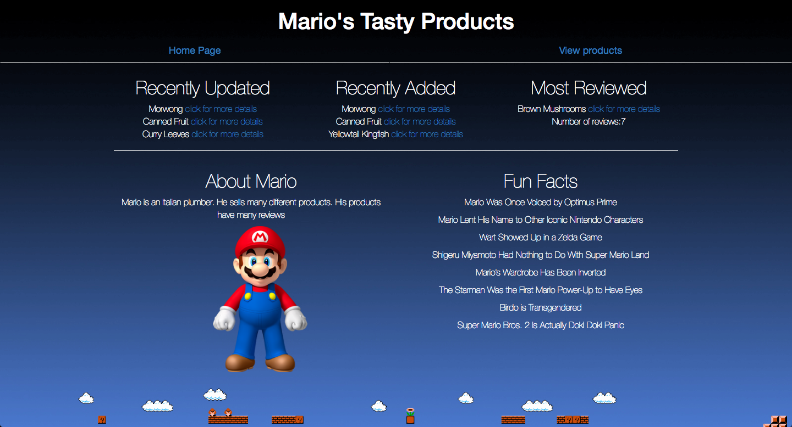
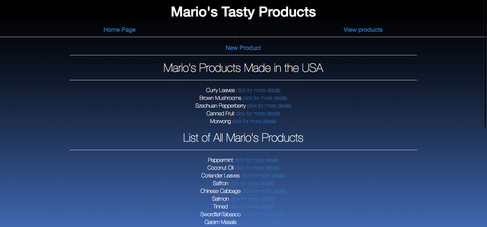

# Mario's Store

#### _This app lets Mario(or anyone else) add products to his store. You can also add individual reviews to each product._

Visit Live Site [here](https://marios-store.herokuapp.com/)

#### By _**James Higgins**_

## Description

_Users can add a new product. Then click into the product to see its details, and see its reviews. Users can also add reviews to each product._

## Setup/Installation Requirements

### Access Atom Files

* _Ensure connection to the Internet_
* _On a mac using spotlight search type in terminal_
* _Once in terminal enter the following commands to clone the file to your desktop and open the repository:_
```
$ cd desktop
$ git clone https://github.com/jamesmilanhiggins/Product-Reviews
$ cd Product-Reviews
$ cd bundle
$ bundle
$ rails db:create
$ rake db:reset
$ rails s
$ open localhost:3000 in your browser
```

## Known Bugs

* There are no known bugs at this time


## Support and contact details

_Please contact James Higgins at James.Milan.Higgins@gmail.com if you have any questions._

## Technologies Used

* Ruby
* Rails
* Bootstrap

### License

*This software is licensed under MIT license.*

Copyright (c) 2017 **_James Higgins**




